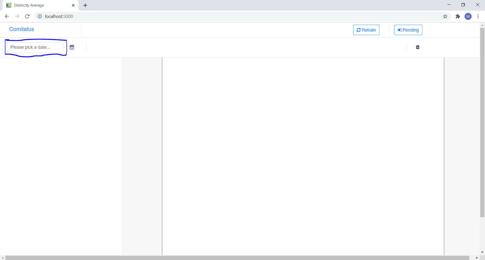
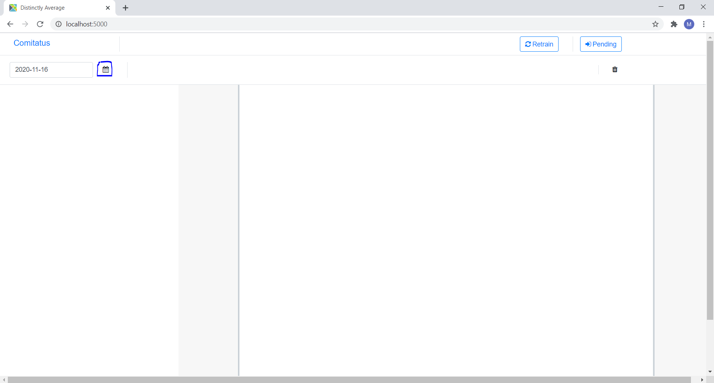
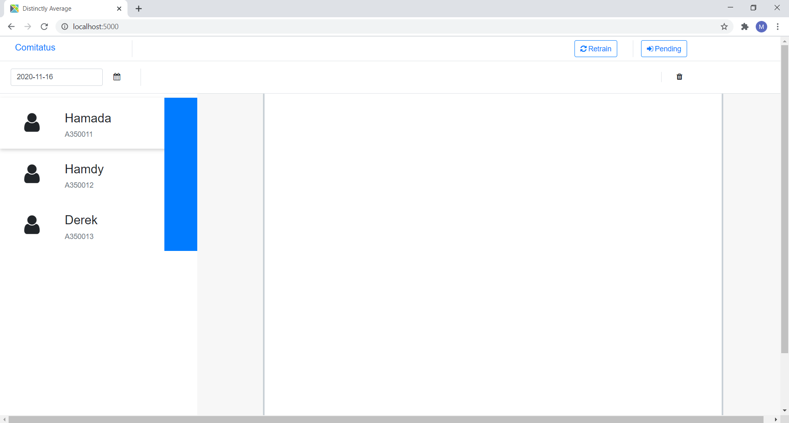
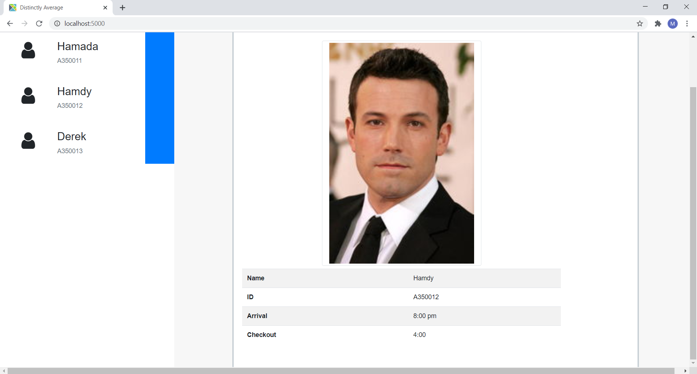

# Elm Showcase

This project is bootstrapped with [Create Elm App](https://github.com/halfzebra/create-elm-app).

That is a part of a project which works with face recognition to record attendance data. This is specifically a frontend used by an admin which pulls data from a DB. A simple mock server is presented in `admin_elm_mockserver` to help show the frontend functionality to some extent.

## Run

Install dependencies in the top directory, in the terminal type
```
npm install
```
Also navigate to the mock server
```
cd admin_elm_mockserver
npm install
```
The following serves the contents of the build directory. In order to run this, it is required to have a tool to serve the build directory i.e. `serve` which can be installed via `npm install -g serve`
Finally to run both the frontend and the mock server
```
npm run serve
```

## Brief Walkthrough
- By default, the elm page is served on http://localhost:5000
- Pick up a date by clicking on the textfield on the top left corner of the screen.

- Click on the calendar button to commit choosing that date.

- A list is shown on the left side pane.

- Click on one of the items to show details.

